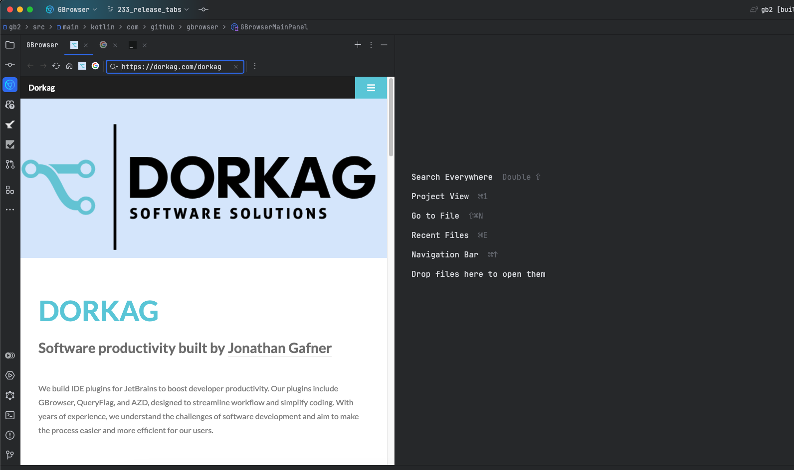
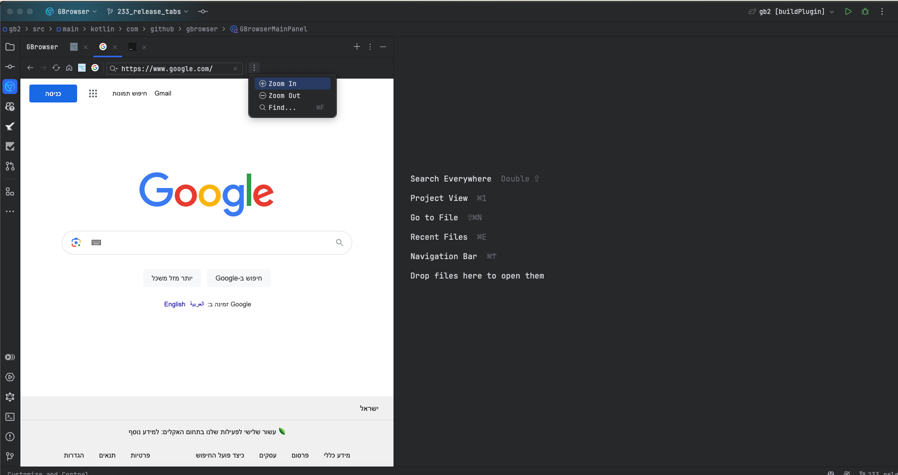

# GBrowser

![GBrowser][file:GBrowser]

## Sponsor

GGBrowser is developed for free.

Please consider support this project by becoming a sponsor using [GitHub sponsors](https://github.com/sponsors/edgafner).

## GBrowser Tool Window

<!-- Plugin description -->
An embedded web browser window within your IDE. Cut the context switch between the browser and you IDE.

## Features

- Browser Actions:
  - Open close Tabs
  - History Back & Forward
  - Refresh
  - Home Page
  - Add Bookmarks with right click
  - Zoom In & Zoom Out
  - Find in Page
  - Dev Tools enable from within the code
- Set a default home page in settings Preferences>>Tools>>GIdea Embedded Browser
- You can always add/remove favorites from the IDE settings Preferences>>Tools>>GIdea Embedded Browser

# Installation

- Using IDE built-in plugin system:

  <kbd>Settings/Preferences</kbd> >
  <kbd>Plugins</kbd> >
  <kbd>Marketplace</kbd> >
  <kbd>Search for GBrowser</kbd> >
  <kbd>Install Plugin</kbd>

<!-- Plugin description end -->

# Screenshots

# Repository activity

# Contributions

Contributions are welcome. Please see the
[contributing guide](https://github.com/edgafner/GBrowser/blob/main/.github/CONTRIBUTING.md) for more details.
The maintainer generally has very little time to work on GBrowser, so the best way to get a bug fixed is to contribute a pull request.

If you'd like to help out, you can start with any of the issues
labeled with `Help wanted`.

[file:GBrowser]: ./.github/readme/Gbrowser.svg

## Built With

- [JetBrains Platform SDK](https://plugins.jetbrains.com/docs/intellij/welcome.html)
- [JCEF](https://github.com/chromiumembedded/java-cef)

 
